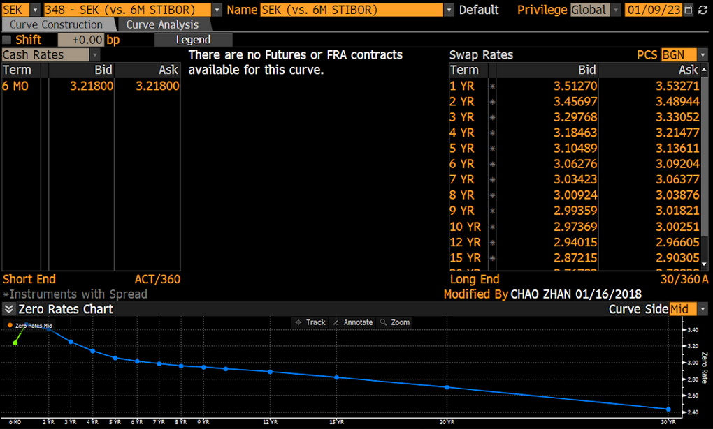
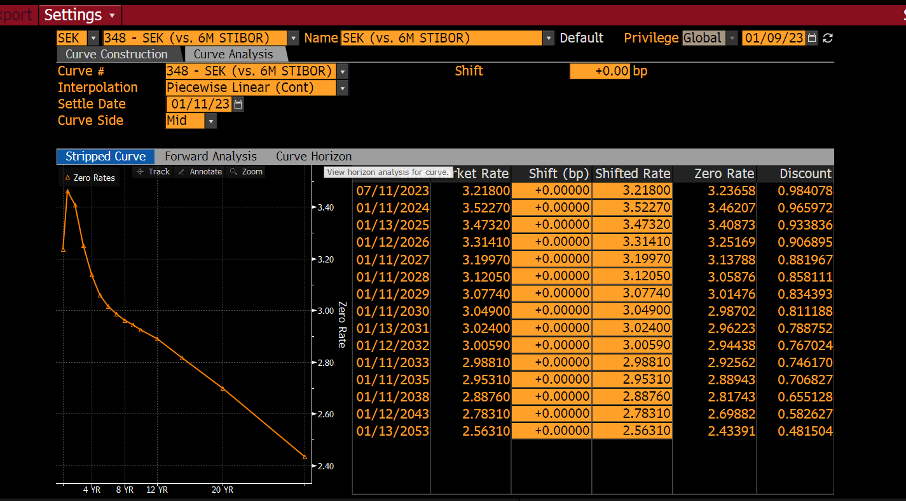

## Introduction
<p style="text-align: justify"> 
The process of calculating a yield curve has many names in the finance industry. it can be called finding the redemption curve, constructing the term structure of interest rates, stripping and so on. In this blog post we will go through the process of constructing the yield curve for the Bloomberg SEK (vs. 6M STIBOR), also known as 348, with the help of the Python package QuantLib.

When reading this tutorial consider that the main goal is to learn how to bootstrap interest rate curves with QuantLib and that Bloomberg's curve will be our answer key to make sure that everything is correct regarding dates, day count and calendar conventions. Moreover, it is assumed that the reader is familiar with instruments such as deposits and swaps - how else would you end up here?

The packages that are needed for this tutorial are:
- QuantLib
- Numpy
</p>

## SEK (vs. 6M STIBOR)
<p style ="text-align: justify">
As shown in Figure 1, the SEK (vs. 6M STIBOR) is a swap curve based on the 6 month Stockholm Interbank Offered Rate, denoted by 6M STIBOR. The cash rate for the 6M STIBOR can be seen on the left-hand side of Figure 1, and the rates for the swaps can be seen on the right-hand side of Figure 1. The day count convention for each panel of instruments can also be observed at the bottom. 

The purpose of the SEK (vs. 6M STIBOR) is to forecast the interest rate for the 6M STIBOR. This means that whatever point we select on the curve is what the market will assume the 6M STIBOR will be in that amount of time. As a result this will forecast the floating leg of a swap.
</p>


|:--:| 
| Figure 1: Quotes for SEK (vs. 6M STIBOR) from Curve Construction in the Bloomberg Terminal. |

## Quantlib
<p style ="text-align: justify">
We begin by setting the desired date and importing the necessary packages. The date at which the bootstrap procedure starts is determined with reference to the top right corner of Figure 2, In this case corresponding to the settlement date which often is T + 2 of the initial date in Sweden. It's important to note that this step is crucial (and may vary across trading desks) in the bootstrapping procedure, as it ensures that the maturity dates of the curve will be correct:
</p>

```python
# Import the necessary packages 

import numpy as np
import quantlib as ql
from datetime import datetime, date, timedelta

# Define the date according to the QuantLib standards
ql_date = ql.Date("2023-01-11", "%Y-%m-%d") 
ql.Settings.instance().evaluationDate = ql_date
```

<p style="text-align: justify"> 
Furthermore, the main approach behind bootstrapping with QuantLib is to define all your instruments using helpers. Helpers are classes designed to define an instrument with its properties, which makes the bootstrapping procedure less cumbersome. There are helpers for each instrument such as: 

- DepositRateHelper
- FraRateHelper
- FuturesRateHelper

and so on, you can find the list of all helpers [here](https://quantlib-python-docs.readthedocs.io/en/latest/thelpers.html). Once you have defined the instruments with helpers, you will want to store them in a list so that you can call ql.PiecewiseLinearZero(), which will find the solutions for the curve given the instruments you have defined.
</p>


<p style ="text-align: justify">
Since the first instrument in curve is the 6M STIBOR, it will be the first instrument to be modeled. The 6M STIBOR is interpreted as a deposit rate, so we use the QuantLib function DepositRateHelper:
</p>

```python
# Create an empty array to store all the helpers as previously mentioned.
store_helpers = []

# Define all the properties of the instrument
stibor_rate = 3.21800 
stibor_maturity= '6M'
stibor_calendar = ql.TARGET()
stibor_fixing_day = 0
stibor_convention = ql.ModifiedFollowing
stibor_day_counter= ql.Actual360()

# Create the DepositRateHelper
stibor_helper = ql.DepositRateHelper(ql.QuoteHandle(ql.SimpleQuote(stibor_rate/100.0)), 
                    ql.Period(stibor_maturity), 
                    stibor_fixing_day,
                    stibor_calendar, 
                    stibor_convention,
                    stibor_day_counter) 
# Store the DepositRateHelper to the list of helpers
store_helpers.append(stibor_helper)
```
<p style = "text-align: justify">

### store_helpers
store_helpers is initially an empty list which will be used to store all the helper objects.

### stibor_rate
The stibor_rate variable stores the rate of the deposit, which can be observed on the left side of Figure 1. Note that the value given in the Bloomberg Terminal is the interest rate of 6M STIBOR given as a percentage. Therefore, as shown in the code, the stibor_rate variable is divided by 100.00 to obtain the true interest rate. 

### stibor_maturity
As mentioned previously, 6M STIBOR is the 6 month average short end interest rate loan that Swedish bank charging each other when loaning without collateral. Therefore, the maturity of the deposit is set to 6 months.

### stibor_calendar
Next up is the calendar, in this case TARGET is applied. TARGET stands for Trans-European Automated Real-time Gross settlement Express Transfer, which is a standarized calendar for financial instruments, selecting the correct calendar is important as they contain the days of which there is a holiday. Holidays are essential to consider as they are a variable to the final maturity date of the instrument.  Note, we have the choice to use ql.SWEDEN() - or make a custom calendar - if we feel that TARGET is missing out on a bank holiday specifically for Sweden. It is up to you to decide what calendar is fit for you. 

### stibor_fixing_day 
We have interpreted the fixing_day input as the settlement date of the instrument which for Swedish instruments are often set to 2 days.

### stibor_convention
Afterwards, the convention for date rolling is set to Modified Following. Date rolling refers to the adjustment of the maturity date given if a business date of our instrument falls on a holiday, as the market is closed on holidays. The maturity date will then typically be shifted to a business day. This will result in the maturity date often having a few extra days before it matures.

### stibor_day_counter
In finance, the day counter of an instrument is used to calculate the exact amount of interest due at a specific point in time. Different day counters use different methods to count the number of days between two dates, and the choice of day counter can have a significant impact on the calculated interest amount. In this setup we can find the day counter of the instrument in the bottom of the rates of Figure 1 as previously mentioned.

---

The next step is to define the swaps. If you search for these swaps on the Bloomberg Terminal it will show that these swaps has a floating leg with underlying based on 6M STIBOR. Unfortunately, the Swedish 6M STIBOR is not a standard index in the Python version of Quantlib as far as I know. Therefore we need to define a custom one which is simply done as follow:
</p>

```python
# The underlying floating rate
stibor_6m = ql.IborIndex('STIBOR6M',            # Name
                         ql.Period('6M'),       # Maturity
                         0,                     # Fixing day
                         ql.SEKCurrency(),      # Currency
                         ql.TARGET(),           # Calendar
                         ql.ModifiedFollowing,  # Calendar convention
                         ql.Actual360())        # Day count
```

<p style = "text-align: justify">
Moreover, the swap rates in Figure 1 are given as ask and bid. The bootstrap procedure is based on the mid price, which is based on the average of the bid and ask:
</p>


```python
# Calculate the mid quotes
bid_list= [3.51270, 3.45697, 3.29768, 3.18463,
 3.10489, 3.06276, 3.03423, 3.00924, 
 2.99359, 2.97369, 2.94015, 2.87215, 
 2.76782, 2.54788]
ask_list = [3.53271, 3.48944, 3.33052, 3.21477,
 3.13611, 3.09204, 3.06377, 3.03876, 
 3.01821, 3.00251, 2.96605, 2.90305, 
 2.79838, 2.57832]
mid = [(bid + ask)/2 for bid, ask in zip(bid_list,ask_list)]
```

<p style = "text-align: justify">
Then continuing with SwapRateHelper: 
</p>

```python
fixedFrequency = ql.Annual
fixedConvention = ql.ModifiedFollowing
fixedDayCount = ql.Thirty360(ql.Thirty360.BondBasis)
calendar = ql.TARGET()

tenor =['1Y', '2Y', '3Y', '4Y', 
        '5Y', '6Y', '7Y', '8Y', 
        '9Y', '10Y', '12Y','15Y',
        '20Y', '30Y']
iborIndex = index
for r,m in zip(mid, tenor):
    rate = ql.QuoteHandle(ql.SimpleQuote(r/100.0))
    tenor = ql.Period(m)
    swap_helper = ql.SwapRateHelper(rate, tenor, calendar,
     fixedFrequency, fixedConvention, fixedDayCount, stibor_6m)
    
    # Append each swap to our store_helpers
    store_helpers.append(swap_helper)
```

<p style = "text-align: justify">
Now that all instruments are defined we can execute the bootstrapping algorithm by using the following:
</p>

```python
curve = ql.PiecewiseLinearZero(0, ql.TARGET(), helpers, ql.Actual365Fixed())
```

<p style = "text-align: justify">
Note that you also have the option to change the calendar and the day count for the bootstrap. You can modify these parameters based on your desired outcome.
</p>

## Result

<p style = "text-align: justify">
The zero rates obtained from Bloomberg are displayed in Figure 2. MEanwhile, the resulting curve generated from QuantLib is shown in Figure 3. To facilitate the comparison of the curves, a table is created to calculate the difference between the results, as presented in Table 1. It is important to note that the basis point difference can be disregarded, as the result from Bloomberg is rounded. Therefore, any extra digits in the basis point difference are solely from the QuantLib approximation. If we were to round them up, they would result in zeros.
</p>


|:--:| 
| Figure 2: The Bloomberg curve SEK (vs. 6M STIBOR) from Curve Construction in the Bloomberg Terminal. |


|:--:| 
| Figure 3: The resulting curve from QuantLib using quotes from Bloomberg. |


|    | Date       |   Quotes|   QuantLib Zero Rates |   Bloomberg Zero Rates |   Basis Point Difference |
|---:|:-----------|--------:|---------------------:|-----------------------:|-------------------------:|
|  1 | 2023-07-13 | 3.218   |              3.23658 |                3.23658 |              -0.015275   |
|  2 | 2024-01-11 | 3.52271 |              3.46208 |                3.46207 |              -0.0746395  |
|  3 | 2025-01-13 | 3.47321 |              3.40873 |                3.40873 |              -0.04655    |
|  4 | 2026-01-12 | 3.3141  |              3.25169 |                3.25169 |              -0.0397416  |
|  5 | 2027-01-11 | 3.1997  |              3.13788 |                3.13788 |               0.038115   |
|  6 | 2028-01-11 | 3.1205  |              3.05876 |                3.05876 |              -0.0230695  |
|  7 | 2029-01-11 | 3.0774  |              3.01476 |                3.01476 |               0.0163274  |
|  8 | 2030-01-11 | 3.049   |              2.98702 |                2.98702 |              -0.00937578 |
|  9 | 2031-01-13 | 3.024   |              2.96223 |                2.96223 |              -0.0348135  |
| 10 | 2032-01-12 | 3.0059  |              2.94438 |                2.94438 |              -0.0386432  |
| 11 | 2033-01-11 | 2.9881  |              2.92562 |                2.92562 |               0.0279722  |
| 12 | 2035-01-11 | 2.9531  |              2.88943 |                2.88943 |              -0.0104289  |
| 13 | 2038-01-11 | 2.8876  |              2.81743 |                2.81743 |              -0.0475918  |
| 14 | 2043-01-12 | 2.7831  |              2.69882 |                2.69882 |              -0.0153047  |
| 15 | 2053-01-13 | 2.5631  |              2.43391 |                2.43391 |              -0.0218202  |
| Table 1: QuantLib and Bloomberg zero rates with their corresponding underlying quotes.|

## Conclusion

<p style = "text-align: justify">

In this blog post we have managed to recreate the SEK (vs. 6M STIBOR) from curve construction from the Bloomberg Terminal using QuantLib. If you are interested in the full Python code you can find [here](https://github.com/test-blog/test-blog-scripts).

In the next post for bootstrapping we will have a look how to manually bootstrap. 

## References
- Luigi Ballabio, *Implementing QuantLib: Quantitative finance in C++: an inside look at the architecture of the QuantLib library*, Autopubblicato
- J HAmish M Darbyshire, *Pricing and Trading Interest Rate Derivatives: A Practical Guide to Swaps*, Aitch & Dee Limited
- Bloomberg L.P., SEK (vs. 6M STIBOR)
</p>