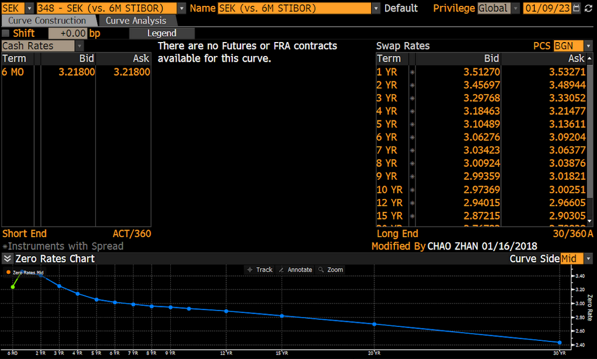

## Introduction
<p style="text-align: justify"> 
The processes of deriving a yield curve has many names in the finance industry, it can be called for example: finding the redemption curve, constructing the term structure of interest rates, stripping and etc. In this blog post we will go through the process of constructing the yield curve for the Bloomberg SEK (vs. 6M STIBOR), also known as 348, with the help of the Python package QuantLib. When reading this tutorial consider that the main goal is to learn how to bootstrap interest rate curves with Quantlib and that Bloomberg's curve will be our answer key to make sure that everything is correct regarding dates, day count and calendar conventions. Moreover, it is assumed that the reader is familiar with instruments such as deposits and swaps - why else would you end up here.

The packages that are needed for this tutorial are:
- QuantLib
- Numpy
## SEK (vs. 6M STIBOR)
<p style ="text-align: justify">
As seen in Figure 1, the SEK (vs. 6M STIBOR) is a swap curve based on the 6 month Stockholm Interbank Offered Rate, which denotes the 6M STIBOR. The cash rate for the 6M STIBOR can be viewed on the left hand side of Figure 1 and on the right handside of Figure 1 the rates for the swaps. From respective panels of the instruments the daycount convention can also be seen in the bottom. The usage of SEK (vs. 6M STIBOR) is to forecast the interest rate for the 6M STIBOR. Thus meaning, that whatever point we select on the curve is what the market will assume the 6M STIBOR will be in that amount of time. As a result this will forecast the floating leg of a swap.
</p>


|:--:| 
| Figure 1: SEK (vs. 6M STIBOR) from Curve Construction in the Bloomberg Terminal. |

## Quantlib
<p style ="text-align: justify">
We initiate with setting the desired date and importing the required packages. The date is set with reference to the top right corner of Figure 1. Note, this is a very important step of the bootstrapping procedure as it will ensure us that the maturity dates of the curve will be correct:
</p>

```python
# Import the necessary packages 

import numpy as np
import quantlib as ql
from datetime import datetime, date, timedelta

# Define the date according the QuantLib standards
ql_date = ql.Date("2023-01-09", "%Y-%m-%d") 
ql.Settings.instance().evaluationDate = ql_date
```

<p style="text-align: justify"> 
Furthermore, the main approach behind bootstrapping with QuantLib is to define all your instruments with the help of helpers. Helpers are functions designed to define an instrument with their properties to make the bootstrapping procedure less painful. There are helpers for each instrument such as: 

- DepositRateHelper
- FraRateHelper
- FuturesRateHelper

and so on, you can find the list of all helpers [here](https://quantlib-python-docs.readthedocs.io/en/latest/thelpers.html). When you have defined the instruments with helpers you want to store them in a list so that you can call ql.PiecewiseLinearZero() which will find the solutions for the curve given the instruments you have defined.
</p>


<p style ="text-align: justify">
As the first instrument in curve is the 6M STIBOR it will be the first instrument to be modelled. 6M STIBOR is interpreted as a deposit rate. Thus, we use the QuantLib function DepositRateHelper:
</p>

```python
# Create an empty array to store all the helpers as previously mentioned.
store_helpers = []

# Define all the properties of the instrument
stibor_rate = 3.21800 
stibor_maturity= '6M'
stibor_calendar = ql.TARGET()
stibor_fixing_day = 0
stibor_convention = ql.ModifiedFollowing
stibor_day_counter= ql.Actual360()

# Create the DepositRateHelper
stibor_helper = ql.DepositRateHelper(ql.QuoteHandle(ql.SimpleQuote(stibor_rate/100.0)), 
                    ql.Period(stibor_maturity), 
                    stibor_fixing_day,
                    stibor_calendar, 
                    stibor_convention,
                    stibor_day_counter) 
# Store the DepositRateHelper to the list of helpers
store_helpers.append(stibor_helper)
```
<p style = "text-align: justify">

### store_helpers
store_helpers is initially an empty list which will be used to store all the helper objects.

### stibor_rate
stibor_rate stores the rate of the deposit which can be observed on the left side of Figure 1. Note that the value given in the Bloomberg Terminal is the interest rate of 6M STIBOR given in procentage. Therefore, as observed in the code, the stibor_rate variable is divided by 100.00 to obtain the true interest rate. 

### stibor_maturity
As mentioned previously, 6M STIBOR is the 6 month average short end interest rate loan that Swedish bank charging each other when loaning without collateral. Therefore, the maturity of the deposit is set to 6 months.

### stibor_calendar
Next up is the calendar, in this case TARGET is applied. TARGET stands for Trans-European Automated Real-time Gross settlement Express Transfer, which is a standarized calendar for financial instruments, selecting the correct calendar is important as they contain the days of which there is a holiday. Holidays are essential to consider as they are a variable to the final maturity date of the instrument.  Note, we have the choice to use ql.SWEDEN() - or make a custom calendar - if we feel that TARGET is missing out on a bank holiday specifically for Sweden. It is up to you to decide what calendar is fit for you. 

### stibor_fixing_day TBA
Fixing days in finance refer to specific dates when the interest rate or other terms of a financial instrument are established or adjusted. In the context of a deposit, fixing days are the dates on which the interest rate for the deposit is set. 

### stibor_convention
Afterwards, the convention for date rolling is set to Modified Following. Date rolling refers to the adjustment of the maturity date given if a business date of our instrument falls on a holiday, as the market is closed on holidays. The maturity date will then typically be shifted to a business day. This will result in the maturity date often having a few extra days before it matures.

### stibor_day_counter
In finance, the day counter of an instrument is used to calculate the exact amount of interest due at a specific point in time. Different day counters use different methods to count the number of days between two dates, and the choice of day counter can have a significant impact on the calculated interest amount. In this setup we can find the day counter of the instrument in the bottom of the rates of Figure 1 as previously mentioned.

---

The next step is to define the swaps. Each swap has a fixed leg which is dependent on an underlying rate, such as 6M EURIBOR. If you search for these swaps on the Bloomberg Terminal it will show that these swaps has a fixed leg with underlying based on 6M STIBOR. Unfortunately, the Swedish 6M STIBOR is not a standard index in the Python version of Quantlib as far as I know. Therefore we need to define a custom one which is simply done as follow:
</p>